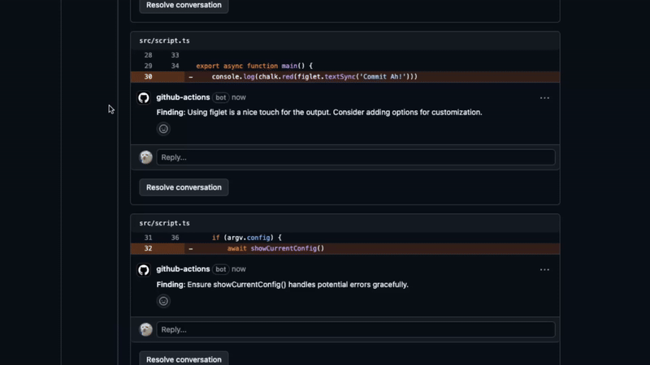
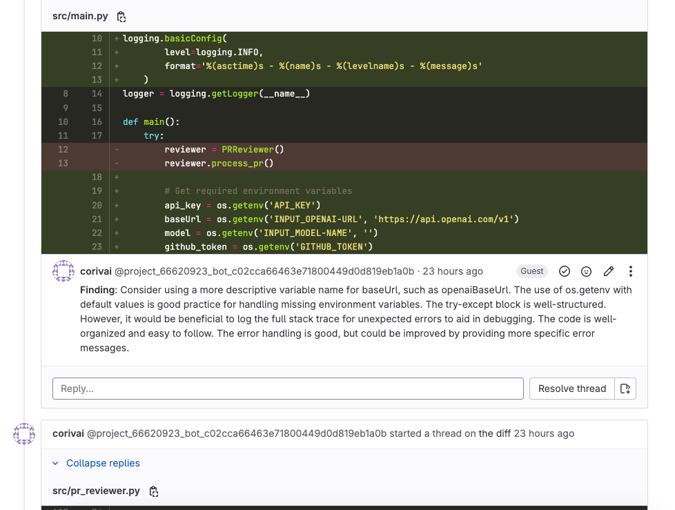

[](https://github.com/marketplace/actions/corivai-code-review-ai-assistant) [](https://gitlab.com/explore/catalog/utsmannn/corivai)

# 🚀 Corivai Github Action - AI Powered Code Review Assistant on your PR

<p align="center">
  
</p>

Corivai is a GitHub Action that provides automated code reviews and interactive discussions using various AI models. It
not only reviews your pull requests but also engages in meaningful conversations through comments, offering explanations
and clarifications when needed.

Here is [Gitlab CI support](#gitlab-support).

## Features

### Automated Code Review

- Code quality assessment and best practices recommendations
- Potential bug detection and security vulnerability identification
- Performance optimization suggestions
- Coding style and consistency checks

### Interactive Comment Responses

- AI-powered responses to questions about its review comments
- Detailed explanations of suggested changes
- Technical discussions through comment threads
- Contextual understanding of the code being discussed

| Automated Code Review               | 
|-------------------------------------|
|  |

| Interactive Comment Responses       |
|-------------------------------------|
|  |

| Gitlab CI support, **Gitlab CI not support interactive Comment** |
|------------------------------------------------------------------|
|                     | 


## Setup Instructions

### 1. Required Secrets

Add these secrets to your GitHub repository:

- `REVIEWER_API_KEY`: Your API key for the chosen AI provider

How
to: https://docs.github.com/en/actions/security-for-github-actions/security-guides/using-secrets-in-github-actions#creating-secrets-for-a-repository

### 2. Workflow Configuration

Create `.github/workflows/code-review.yml` in your repository:

```yaml
name: AI Code Review

on:
  # Triggered when a pull request is opened or updated
  pull_request:
    types: [ opened, synchronize ]

  # Triggered when someone comments on a review
  pull_request_review_comment:
    types: [ created ]

jobs:
  review:
    runs-on: ubuntu-latest
    permissions:
      pull-requests: write
      contents: write

    steps:
      - uses: actions/checkout@v3

      - name: AI Code Review
        uses: utsmannn/corivai@v5
        with:
          reviewer-api-key: ${{ secrets.REVIEWER_API_KEY }}
          github-token: ${{ secrets.GITHUB_TOKEN }}
          model-name: 'your-model-name'
          openai-url: 'your-endpoint-url' # optional, default: https://api.openai.com/v1
          max-diff-size: '100000' # optional
          custom-instructions: | # optional
            Your custom review guidelines here
```

## Configuration Parameters

| Parameter           | Required | Description                       | Default                   | Example Values                      |
|---------------------|----------|-----------------------------------|---------------------------|-------------------------------------|
| reviewer-api-key    | Yes      | Authentication key for AI service | -                         | Gemini API key, 'ollama'            |
| github-token        | Yes      | GitHub token for API access       | -                         | ${{ secrets.GITHUB_TOKEN }}         |
| model-name          | Yes      | AI model identifier               | -                         | 'gemini-pro', 'codellama'           |
| openai-url          | No       | AI service endpoint URL           | https://api.openai.com/v1 | See provider-specific configs below |
| max-diff-size       | No       | Maximum diff size in bytes        | 100000                    | '500000'                            |
| custom-instructions | No       | Additional review guidelines      | -                         | Markdown formatted instructions     |

## Provider-Specific Configurations

### OpenAI (Default)

See: https://platform.openai.com/docs/quickstart

Models: https://platform.openai.com/docs/models

```yaml
- name: AI Code Review
  uses: utsmannn/corivai@v5
  with:
    reviewer-api-key: ${{ secrets.OPENAI_API_KEY }}
    github-token: ${{ secrets.GITHUB_TOKEN }}
    model-name: 'gpt-3.5-turbo'
 ```

### Google Gemini API (Low price recommended)

See: https://ai.google.dev/gemini-api/docs/openai

Models: https://ai.google.dev/gemini-api/docs/models/gemini

```yaml
- name: AI Code Review
  uses: utsmannn/corivai@v5
  with:
    reviewer-api-key: ${{ secrets.GEMINI_API_KEY }}
    github-token: ${{ secrets.GITHUB_TOKEN }}
    model-name: 'gemini-1.5-flash'
    openai-url: 'https://generativelanguage.googleapis.com/v1beta/openai/'
```

### Ollama (Self-hosted or Cloud)

See: https://ollama.com/blog/openai-compatibility

```yaml
- name: AI Code Review
  uses: utsmannn/corivai@v5
  with:
    reviewer-api-key: 'ollama'
    github-token: ${{ secrets.GITHUB_TOKEN }}
    model-name: 'codellama'  # or other models like 'llama2', 'mixtral'
    openai-url: 'http://your-ollama-endpoint/v1'
```

### DeepSeek

See: https://api-docs.deepseek.com/

Models: https://api-docs.deepseek.com/quick_start/pricing

```yaml
- name: AI Code Review
  uses: utsmannn/corivai@v5
  with:
    reviewer-api-key: ${{ secrets.DEEPSEEK_API_KEY }}
    github-token: ${{ secrets.GITHUB_TOKEN }}
    model-name: 'deepseek-coder'
    openai-url: 'https://api.deepseek.com/v1'
```

## Workflow Details

### Pull Request Review Process

1. When a pull request is opened or updated:
    - The action retrieves the diff content
    - Changes are processed in manageable chunks
    - Each chunk is analyzed by the AI model
    - Review comments are posted on specific lines
    - A completion comment is added with the processed SHA

2. Review comment format:
   ```
   **Finding**: [AI's review comment]
   ```

### Comment Response System

1. When a user replies to a review comment:
    - The action captures the conversation context
    - Processes the entire comment thread
    - Generates a contextually aware response
    - Posts the response as a reply

2. Comment thread handling:
    - Maintains conversation context
    - References the original code snippet
    - Considers all previous replies in the thread
    - Provides detailed technical explanations

## Advanced Usage

### Custom Review Guidelines

```yaml
custom-instructions: |
  ## Review Priority
  1. Security vulnerabilities
  2. Performance issues
  3. Code maintainability
  4. Documentation quality

  ## Specific Checks
  - SQL injection vulnerabilities
  - Resource leaks
  - Error handling completeness
  - Test coverage adequacy
```

### Large Repository Configuration

```yaml
- name: AI Code Review
  uses: utsmannn/corivai@v5
  with:
    reviewer-api-key: ${{ secrets.REVIEWER_API_KEY }}
    github-token: ${{ secrets.GITHUB_TOKEN }}
    model-name: 'gemini-pro'
    open-ai-url: 'https://generativelanguage.googleapis.com/v1'
    max-diff-size: '500000'  # Increased for larger diffs
    custom-instructions: |
      Focus on critical issues only
      Skip minor style suggestions
```

## Troubleshooting

### Common Issues

1. Authentication Failures
    - Verify API key validity and permissions
    - Check secret configuration in repository settings
    - Ensure endpoint URL is correctly formatted

2. Review Timeout Issues
    - Reduce max-diff-size parameter
    - Split large pull requests into smaller ones
    - Check AI provider's timeout limits

3. Comment Response Problems
    - Verify GitHub token permissions
    - Check comment thread depth limits
    - Ensure bot has write access to pull requests

### Debug Mode

Add environment variable `ACTIONS_STEP_DEBUG=true` in repository settings for detailed logging.

## Best Practices

1. Pull Request Size
    - Keep changes focused and minimal
    - Split large changes into multiple PRs
    - Target less than 50% of max-diff-size

2. Comment Interactions
    - Ask specific questions in replies
    - Reference relevant code sections
    - Keep thread depth reasonable

3. Custom Instructions
    - Be specific about priorities
    - Include project-specific guidelines
    - Update based on team feedback

<h2 id="gitlab-support">Gitlab Support</h3>

[](https://gitlab.com/explore/catalog/utsmannn/corivai)

You can find this GitLab component in the GitLab catalog.

**The Gitlab CI only support for review code!**

### Setup Instructions for GitLab CI

1. Create an access token in your project
    - Go to **Settings > Access tokens > Add new token**
    - Select the following scopes: `api`, `read_api`, `read_repository`, `write_repository`
    - **Name the token the same as your bot name** (commented).

2. Store your token in a variable
    - Go to **CI/CD > Variables > Add variable**
    - Make sure the token is visible in jobs by using these settings:
        - **Visibility**: Visible
        - **Flags**: **_Uncheck_** "Protect variable"
        - **Key**: Your variable name

Finally, add the following to your `.gitlab-ci.yml` file:

```yaml
include:
  - component: $CI_SERVER_FQDN/utsmannn/corivai/code-review@v8.0.0
    inputs:
      stage: build
      gitlab-token: '$GITLAB_TOKEN'
      reviewer-api-key: 'ollama'
      openai-url: "https://o.codeutsman.com/v1"
      max-diff-size: "500000"
      model-name: "qwen2.5-coder"
```

## Contributing

We welcome contributions to improve Corivai:

1. Fork the repository
2. Create a feature branch
3. Submit a pull request with detailed description
4. Ensure tests pass and documentation is updated

## License

This project is licensed under the MIT License - see the LICENSE file for details.

## Support

For issues and feature requests, please use the GitHub Issues section of the repository.